# linktools-cntr

Docker 容器部署和管理工具，为 homelab 及服务器环境提供统一的容器生命周期管理（命令前缀 `ct-cntr`）。

## 重大变更（迁移说明）

- `ct-cntr compose` 不再是命令组，`compose up/restart/down/status/config/validate` 全部删除，无兼容 alias：
  - `ct-cntr compose up/restart/down/status` → `ct-cntr up/restart/down/status`
  - `ct-cntr compose config` → `ct-cntr compose`
  - `ct-cntr compose validate` → `ct-cntr compose --check`
- Compose 中用户自己写的相对路径（`build`/`build.context`/`env_file`/`volumes` 短语法）不再被自动改写为绝对路径；仓库作者需要绝对路径时应在模板中显式使用 `{{ SOURCE_PATH }}`/`{{ APP_DATA_PATH }}` 等变量。
- `ct-cntr status` 改为基于 `docker compose ... ps --quiet` + `docker inspect` 获取真实状态，不再依赖 `docker compose ps --format json` 的输出。
- 损坏的 `container.lock.json` 现在会明确报错（`lock --check`/`diff` 非零退出，`doctor` 报告 `lock.invalid`），不再被当成“无锁文件”。
- `.linktools.json` 中声明的 `docker-engine`/`docker-compose` 版本要求现在会实际阻断 `up`/`restart`/`compose`/`lock`/`plan up`/`plan restart`（`down`/`status`/`doctor`/`plan down` 不受影响）。

## 开始使用

以基于 Debian 的系统为例，先安装运行环境：

```bash
# 安装 Python3、Git、Docker、Docker Compose
wget -qO- get.docker.com | bash
sudo apt-get update
sudo apt-get install -y python3 python3-pip git docker-compose-plugin
```

安装 linktools-cntr：

```bash
python3 -m pip install -U linktools linktools-cntr

# 安装 GitHub 最新开发版
python3 -m pip install --ignore-installed \
  "linktools@ git+https://github.com/linktools-toolkit/linktools.git@master#subdirectory=linktools" \
  "linktools-cntr@ git+https://github.com/linktools-toolkit/linktools.git@master#subdirectory=linktools-cntr"
```

## 容器部署示例

### All in one 环境

PVE、OpenWRT、飞牛 OS、WAF、SSO、导航页等等

👉 [搭建文档](https://github.com/linktools-toolkit/linktools-homelab/blob/master/2xx-homelab/221-fnos/README.md)

### Xray Server

gRPC + SSL + VLESS

👉 [搭建文档](https://github.com/linktools-toolkit/linktools-homelab/blob/master/3xx-proxy/320-xray-server/README.md)

### Redroid

Docker 版 Android 容器，以及编译环境

👉 [搭建文档](https://github.com/linktools-toolkit/linktools-homelab/blob/master/4xx-mobile/400-redroid/README.md)

## 内置容器

linktools-cntr 内置了常用容器定义，开箱即用：

| 容器 | 说明 |
|------|------|
| nginx | 反向代理（含 ACME 自动证书） |
| lldap | 轻量级 LDAP 目录服务 |
| authelia | 单点登录 / 双因素认证 |
| safeline | Web 应用防火墙 |
| portainer | 容器可视化管理界面 |

更多容器可通过添加外部仓库获取（参见下方仓库管理命令）。

## 内置配置项

首次部署时会引导填写配置项，内置的全局配置参数包括：

| 参数 | 类型 | 默认值 | 描述 |
|------|------|--------|------|
| `CONTAINER_TYPE` | str | — | 容器运行时：`docker` / `docker-rootless`（Podman 已不再支持） |
| `DOCKER_USER` | str | 当前用户 | 部分 rootless 容器使用此用户权限运行 |
| `DOCKER_HOST` | str | `/var/run/docker.sock` | Docker Daemon 地址 |
| `DOCKER_APP_PATH` | str | `~/.linktools/data/container/app` | 容器数据持久化目录（建议置于 SSD） |
| `DOCKER_APP_DATA_PATH` | str | 默认同`DOCKER_APP_PATH` | 不频繁读写的持久化目录（可置于 HDD） |
| `HOST` | str | 当前局域网 IP | 宿主机 IP 地址 |

## 常用命令

```bash
# 查看帮助（每个子命令均支持 -h 参数）
ct-cntr -h

#######################
# 仓库管理（支持 git 链接和本地路径）
#######################

# 添加容器仓库
ct-cntr repo add https://github.com/linktools-toolkit/linktools-homelab

# 拉取仓库最新代码
ct-cntr repo update

# 删除仓库
ct-cntr repo remove

#######################
# 容器安装列表管理
#######################

# 添加要部署的容器
ct-cntr add nginx lldap authelia portainer

# 从部署列表移除容器
ct-cntr remove nginx

#######################
# 容器生命周期管理
#######################

# 启动容器
ct-cntr up

# 重启容器
ct-cntr restart

# 停止容器
ct-cntr down

#######################
# 配置管理
#######################

# 查看 linktools-cntr 自身配置的帮助（Docker Compose 配置见下方 ct-cntr compose）
ct-cntr config

# 列出所有配置变量
ct-cntr config list

# 设置配置变量
ct-cntr config set NGINX_ROOT_DOMAIN=example.com ACME_DNS_API=dns_ali Ali_Key=xxx Ali_Secret=yyy

# 删除配置变量
ct-cntr config unset NGINX_ROOT_DOMAIN ACME_DNS_API Ali_Key Ali_Secret

# 使用编辑器直接编辑配置文件
ct-cntr config edit --editor vim

# 重新加载配置
ct-cntr config reload
```

## 进阶功能

```bash
#######################
# 输出最终解析后的 Docker Compose 模型（只读；不涉及生命周期）
#######################

ct-cntr compose                        # 完整已安装项目
ct-cntr compose nginx --format json    # 只筛选 nginx 对应的 service
ct-cntr compose --check                # 只校验，不输出内容

#######################
# 实际运行状态（只读，默认不弹 sudo 密码）
#######################

ct-cntr status
ct-cntr status --json
ct-cntr status --sudo-prompt

#######################
# 执行计划（只展示会发生什么，不实际执行）
#######################

ct-cntr plan up
ct-cntr up --dry-run

#######################
# 部署锁定（完全可选，不影响 up/restart/down 默认行为）
#######################

ct-cntr lock          # 生成/更新 container.lock.json
ct-cntr lock --check  # 与已有 lock 比对，仅在有 drift 时非零退出
ct-cntr diff          # 展示 repo/容器/生成文件的 drift 详情

#######################
# 诊断（只读；--json 输出结构化结果供 CI 使用）
#######################

ct-cntr doctor --json
ct-cntr doctor --check        # 存在 WARN 或更严重（ERROR）级别 finding 时非零退出
ct-cntr doctor --runtime      # 额外校验 compose config 及仓库声明的运行时版本要求
ct-cntr doctor --sudo-prompt  # 允许运行时探测交互式输入 sudo 密码（默认 sudo -n，不阻塞）
```

### 仓库清单（`.linktools.json`）

容器仓库可以在根目录放置一个 `.linktools.json`，声明仓库自身的名称、版本以及最低 `linktools-cntr`/Python/`docker-engine`/`docker-compose` 版本要求。缺失该文件的仓库按“遗留仓库”处理，行为不变；`linktools-cntr`/Python 版本不满足要求的仓库会在 `repo add`/加载前被拒绝，其中的 `container.py` 不会被执行。

```json
{
  "schema_version": 1,
  "kind": "linktools-cntr-repository",
  "name": "linktools-homelab",
  "version": "1.2.0",
  "requires": {
    "linktools-cntr": ">=0.10.0,<1.0",
    "python": ">=3.6",
    "docker-compose": ">=2.20"
  }
}
```

`docker-engine`/`docker-compose` 版本要求在实际运行时校验：不满足时会阻断 `up`/`restart`/`compose`/`compose --check`/`lock`/`plan up`/`plan restart`（聚合报告所有涉及的仓库后一次性失败），但不阻断 `down`/`status`/`doctor`/`plan down`——版本约束不应妨碍停止或诊断已运行的容器。

```bash
ct-cntr repo status --runtime
ct-cntr repo validate --json
ct-cntr repo update --json   # 每个仓库都会更新并重新校验；任意仓库更新失败或不兼容都会让命令非零退出
```

## 容器事件时序

linktools-cntr 通过一套生命周期事件系统统一管理容器的启动、停止流程。Manager 按依赖顺序对目标容器依次触发各阶段事件，再驱动 Docker Compose 执行。

> **target_containers**：默认为全部已安装容器；指定容器名（如 `ct-cntr up nginx`）时仅为指定的子集。

```mermaid
sequenceDiagram
    autonumber
    actor User
    participant CLI
    participant ContainerManager
    participant Container

    %% ─── 初始化 & 准备 ───
    rect rgb(240, 240, 220)
        Note over CLI,Container: 初始化阶段（每次执行任意 ct-cntr 命令）
        User->>CLI: ct-cntr <command>
        CLI->>ContainerManager: 扫描 container.py / docker-compose.yml
        loop 每个容器
            ContainerManager->>Container: on_init()
        end
    end

    rect rgb(230, 235, 245)
        Note over CLI,Container: 准备阶段（up / restart / down / config / exec 等）
        CLI->>ContainerManager: prepare_installed_containers()
        ContainerManager->>ContainerManager: resolve_depend_containers()（依赖解析 & 排序）
        loop 每个容器（逆序，低优先级先写默认配置）
            ContainerManager->>Container: configs（写入全局默认配置）
        end
        loop 每个容器
            ContainerManager->>Container: on_prepare()
        end
        loop 每个容器（正序）
            ContainerManager->>Container: docker_file（渲染 Dockerfile 模板）
            ContainerManager->>Container: docker_compose（渲染 docker-compose.yml 模板）
            ContainerManager->>Container: exposes（加载对外服务链接）
        end
    end

    %% ─── 启动流程 ───
    rect rgb(220, 240, 220)
        Note over CLI,Container: ct-cntr up
        loop 每个容器（正序）
            ContainerManager->>Container: on_check(ctx)
            ContainerManager->>Container: on_starting(ctx)
            ContainerManager->>Container: start_hooks[i]()（mkdir / chown / 写 Nginx 配置…）
        end
        ContainerManager->>ContainerManager: manager.start_hooks[i]()
        ContainerManager->>CLI: yield
        CLI->>CLI: docker compose build / up --detach
        loop 每个容器（逆序）
            ContainerManager->>Container: on_started(ctx)
        end
        alt is_full_containers == True
            ContainerManager->>Container: on_removed(ctx)（孤立容器清理）
        end
    end

    %% ─── 停止流程 ───
    rect rgb(240, 220, 220)
        Note over CLI,Container: ct-cntr down
        loop 每个容器（逆序）
            ContainerManager->>Container: on_stopping(ctx)
        end
        ContainerManager->>CLI: yield
        CLI->>CLI: docker compose stop / down
        loop 每个容器（正序）
            ContainerManager->>Container: on_stopped(ctx)
            ContainerManager->>Container: stop_hooks[i]()
        end
        ContainerManager->>ContainerManager: manager.stop_hooks[i]()
        alt is_full_containers == True
            ContainerManager->>Container: on_removed(ctx)（孤立容器清理）
        end
    end

    %% ─── 重启流程 ───
    rect rgb(235, 225, 245)
        Note over CLI,Container: ct-cntr restart（= down 流程 + up 流程）
        loop 每个容器（逆序）
            ContainerManager->>Container: on_stopping(ctx)
        end
        ContainerManager->>CLI: yield
        CLI->>CLI: docker compose stop
        loop 每个容器（正序）
            ContainerManager->>Container: on_stopped(ctx)
            ContainerManager->>Container: stop_hooks[i]()
        end
        ContainerManager->>ContainerManager: manager.stop_hooks[i]()
        loop 每个容器（正序）
            ContainerManager->>Container: on_check(ctx)
            ContainerManager->>Container: on_starting(ctx)
            ContainerManager->>Container: start_hooks[i]()
        end
        ContainerManager->>ContainerManager: manager.start_hooks[i]()
        ContainerManager->>CLI: yield
        CLI->>CLI: docker compose build / up --detach
        loop 每个容器（逆序）
            ContainerManager->>Container: on_started(ctx)
        end
        alt is_full_containers == True
            ContainerManager->>Container: on_removed(ctx)（孤立容器清理）
        end
    end
```



## 相关链接

- GitHub: <https://github.com/linktools-toolkit/linktools/tree/master/linktools-cntr>
- homelab 容器仓库示例: <https://github.com/linktools-toolkit/linktools-homelab>
