# linktools-cntr

Docker 容器部署和管理工具，为 homelab 及服务器环境提供统一的容器生命周期管理（命令前缀 `ct-cntr`）。

## 重大变更（迁移说明）

- `ct-cntr` 根命令及 `config`/`repo` 子命令的帮助顺序现在是显式、固定的契约（见下方“常用命令”顺序），不再依赖代码声明顺序。
- `ct-cntr lock`/`ct-cntr diff` 命令、部署锁定（Deployment Lock）功能整体删除，`container.lock.json` 不再被读取或写入；已有的该文件不受影响，也不再有任何命令读取它，可自行删除。
- 裸 `ct-cntr config`（不带子命令）现在只显示帮助，不再转发到 Compose 输出，也不再有 deprecation 提示。
- `linktools.cntr.__main__` 只导出 `Command`/`command`；此前的 `manager`/`RepoCommand`/`ConfigCommand`/`ExecCommand` 等内部重导出全部删除，需要这些类的代码应改为从各自的 `linktools.cntr.commands.*` 模块导入。
- `.linktools.json` 从 cntr 专属仓库清单升级为通用 Linktools 项目清单：
  - `kind` 由 `linktools-cntr-repository` 改为 `linktools-project`，旧值不再被接受，无兼容解析或自动转换；
  - cntr 专属的 requirement 从顶层 `requires`（`linktools-cntr`/`docker-engine`/`docker-compose`）迁移到 `components.cntr.requires`（`package:linktools-cntr`/`runtime:docker-engine`/`runtime:docker-compose`）；
  - 清单存在但没有 `components.cntr` 块时，该项目视为未声明 cntr 能力，不会被扫描（不再当作遗留仓库处理）；
  - `requires` 中此前未被识别的 key（如自定义工具名）现在会导致 `repo add`/`repo update`/仓库加载直接失败，而不是仅作为 `doctor` 的 INFO 提示——清单声明了当前 cntr 版本无法校验的要求时，不能假定其兼容。
- `ct-cntr compose` 不再是命令组，`compose up/restart/down/status/config/validate` 全部删除，无兼容 alias：
  - `ct-cntr compose up/restart/down/status` → `ct-cntr up/restart/down/status`
  - `ct-cntr compose config` → `ct-cntr compose`
  - `ct-cntr compose validate` → `ct-cntr compose --check`
- Compose 中用户自己写的相对路径（`build`/`build.context`/`env_file`/`volumes` 短语法）不再被自动改写为绝对路径；仓库作者需要绝对路径时应在模板中显式使用 `{{ SOURCE_PATH }}`/`{{ APP_DATA_PATH }}` 等变量。
- `ct-cntr status` 改为基于 `docker compose ... ps --quiet` + `docker inspect` 获取真实状态，不再依赖 `docker compose ps --format json` 的输出。
- `.linktools.json` 中声明的 `runtime:docker-engine`/`runtime:docker-compose` 版本要求会实际阻断 `up`/`restart`/`compose`/`plan up`/`plan restart`（`down`/`status`/`doctor`/`plan down` 不受影响）。

## 开始使用

以基于 Debian 的系统为例，先安装运行环境：

```bash
# 安装 Python3、Git、Docker、Docker Compose
wget -qO- get.docker.com | bash
sudo apt-get update
sudo apt-get install -y python3 python3-pip git docker-compose-plugin
```

安装 linktools-cntr：

```bash
python3 -m pip install -U linktools linktools-cntr

# 安装 GitHub 最新开发版
python3 -m pip install --ignore-installed \
  "linktools@ git+https://github.com/linktools-toolkit/linktools.git@master#subdirectory=linktools" \
  "linktools-cntr@ git+https://github.com/linktools-toolkit/linktools.git@master#subdirectory=linktools-cntr"
```

## 容器部署示例

### All in one 环境

PVE、OpenWRT、飞牛 OS、WAF、SSO、导航页等等

👉 [搭建文档](https://github.com/linktools-toolkit/linktools-homelab/blob/master/2xx-homelab/221-fnos/README.md)

### Xray Server

gRPC + SSL + VLESS

👉 [搭建文档](https://github.com/linktools-toolkit/linktools-homelab/blob/master/3xx-proxy/320-xray-server/README.md)

### Redroid

Docker 版 Android 容器，以及编译环境

👉 [搭建文档](https://github.com/linktools-toolkit/linktools-homelab/blob/master/4xx-mobile/400-redroid/README.md)

## 内置容器

linktools-cntr 内置了常用容器定义，开箱即用：

| 容器 | 说明 |
|------|------|
| nginx | 反向代理（含 ACME 自动证书） |
| lldap | 轻量级 LDAP 目录服务 |
| authelia | 单点登录 / 双因素认证 |
| safeline | Web 应用防火墙 |
| portainer | 容器可视化管理界面 |

更多容器可通过添加外部仓库获取（参见下方仓库管理命令）。

## 内置配置项

首次部署时会引导填写配置项，内置的全局配置参数包括：

| 参数 | 类型 | 默认值 | 描述 |
|------|------|--------|------|
| `CONTAINER_TYPE` | str | — | 容器运行时：`docker` / `docker-rootless`（Podman 已不再支持） |
| `DOCKER_USER` | str | 当前用户 | 部分 rootless 容器使用此用户权限运行 |
| `DOCKER_HOST` | str | `/var/run/docker.sock` | Docker Daemon 地址 |
| `DOCKER_APP_PATH` | str | `~/.linktools/data/container/app` | 容器数据持久化目录（建议置于 SSD） |
| `DOCKER_APP_DATA_PATH` | str | 默认同`DOCKER_APP_PATH` | 不频繁读写的持久化目录（可置于 HDD） |
| `HOST` | str | 当前局域网 IP | 宿主机 IP 地址 |

## 常用命令

```bash
# 查看帮助（每个子命令均支持 -h 参数）
ct-cntr -h

#######################
# 仓库管理（支持 git 链接和本地路径）
#######################

# 添加容器仓库
ct-cntr repo add https://github.com/linktools-toolkit/linktools-homelab

# 拉取仓库最新代码
ct-cntr repo update

# 删除仓库
ct-cntr repo remove

#######################
# 容器安装列表管理
#######################

# 添加要部署的容器
ct-cntr add nginx lldap authelia portainer

# 从部署列表移除容器
ct-cntr remove nginx

#######################
# 容器生命周期管理
#######################

# 启动容器
ct-cntr up

# 重启容器
ct-cntr restart

# 停止容器
ct-cntr down

#######################
# 配置管理
#######################

# 查看 linktools-cntr 自身配置的帮助（Docker Compose 配置见下方 ct-cntr compose）
ct-cntr config

# 列出所有配置变量
ct-cntr config list

# 设置配置变量
ct-cntr config set NGINX_ROOT_DOMAIN=example.com ACME_DNS_API=dns_ali Ali_Key=xxx Ali_Secret=yyy

# 删除配置变量
ct-cntr config unset NGINX_ROOT_DOMAIN ACME_DNS_API Ali_Key Ali_Secret

# 使用编辑器直接编辑配置文件
ct-cntr config edit --editor vim

# 重新加载配置
ct-cntr config reload
```

## 进阶功能

```bash
#######################
# 输出最终解析后的 Docker Compose 模型（只读；不涉及生命周期）
#######################

ct-cntr compose                        # 完整已安装项目
ct-cntr compose nginx --format json    # 只筛选 nginx 对应的 service
ct-cntr compose --check                # 只校验，不输出内容

#######################
# 实际运行状态（只读；如需要 sudo 密码会阻塞等待输入）
#######################

ct-cntr status
ct-cntr status --json

#######################
# 执行计划（只展示会发生什么，不实际执行）
#######################

ct-cntr plan up
ct-cntr up --dry-run

#######################
# 诊断（只读；--json 输出结构化结果供 CI 使用）
#######################

ct-cntr doctor --json
ct-cntr doctor --check        # 存在 WARN 级别 finding 时非零退出
ct-cntr doctor --runtime      # 额外对实际 docker/compose 运行时校验 compose config
```

### 本地文件配置（`.linktools.json`）

`.linktools.json`/`linktools.json` 是通用的项目清单（project profile，`linktools.core.ProjectProfile` 负责读取与合并），不是 cntr 专属格式，也不是独立的配置系统——它只是接入现有 ConfigResolver 的两个轻量文件层：用户级 `~/.linktools/linktools.json` 与本地级 `<root>/.linktools.json`。不要求 `version`/`kind`/`schema_version`/`components`。容器仓库可以在根目录放置本地文件，声明该仓库对 `linktools-cntr` 的版本要求（`requires`），以及仓库内容器的本地默认环境值（`environment`）。缺失该文件的仓库正常可用，行为不变。

```json
{
  "requires": {
    "linktools-cntr": ">=0.10.0,<1.0"
  },
  "environment": {
    "STORAGE_PATH": "./storage"
  }
}
```

cntr 只读取仓库自己本地文件里的 `requires.linktools-cntr`——用户级文件、`ct-cntr config set` 持久化值、运行时覆盖都不能放宽或覆盖仓库自身声明的兼容性要求。不满足（或 specifier 非法）时，`repo add`/`repo update`/加载都会在该仓库的 `container.py` 被导入前拒绝；`requires` 中的其他 key（如未来的 `linktools-ai`）cntr 完全忽略。

不再有 Docker/Compose 运行时版本门禁：`up`/`restart`/`compose`/`plan` 不再因为仓库声明的运行时版本要求被阻断；`doctor --runtime`/`ct-cntr up` 等仍然会对实际 docker/compose 运行时做只读校验，但那与 `.linktools.json` 的 `requires` 无关。

```bash
ct-cntr repo status
ct-cntr repo validate --json
ct-cntr repo update --json   # 每个仓库都会更新并重新校验；任意仓库更新失败或不兼容都会让命令非零退出
```

## 容器事件时序

linktools-cntr 通过一套生命周期事件系统统一管理容器的启动、停止流程。Manager 按依赖顺序对目标容器依次触发各阶段事件，再驱动 Docker Compose 执行。

> **target_containers**：默认为全部已安装容器；指定容器名（如 `ct-cntr up nginx`）时仅为指定的子集。

```mermaid
sequenceDiagram
    autonumber
    actor User
    participant CLI
    participant ContainerManager
    participant Container

    %% ─── 初始化 & 准备 ───
    rect rgb(240, 240, 220)
        Note over CLI,Container: 初始化阶段（每次执行任意 ct-cntr 命令）
        User->>CLI: ct-cntr <command>
        CLI->>ContainerManager: 扫描 container.py / docker-compose.yml
        loop 每个容器
            ContainerManager->>Container: on_init()
        end
    end

    rect rgb(230, 235, 245)
        Note over CLI,Container: 准备阶段（up / restart / down / config / exec 等）
        CLI->>ContainerManager: prepare_installed_containers()
        ContainerManager->>ContainerManager: resolve_depend_containers()（依赖解析 & 排序）
        loop 每个容器（逆序，低优先级先写默认配置）
            ContainerManager->>Container: configs（写入全局默认配置）
        end
        loop 每个容器
            ContainerManager->>Container: on_prepare()
        end
        loop 每个容器（正序）
            ContainerManager->>Container: docker_file（渲染 Dockerfile 模板）
            ContainerManager->>Container: docker_compose（渲染 docker-compose.yml 模板）
            ContainerManager->>Container: exposes（加载对外服务链接）
        end
    end

    %% ─── 启动流程 ───
    rect rgb(220, 240, 220)
        Note over CLI,Container: ct-cntr up
        loop 每个容器（正序）
            ContainerManager->>Container: on_check(ctx)
            ContainerManager->>Container: on_starting(ctx)
            ContainerManager->>Container: start_hooks[i]()（mkdir / chown / 写 Nginx 配置…）
        end
        ContainerManager->>ContainerManager: manager.start_hooks[i]()
        ContainerManager->>CLI: yield
        CLI->>CLI: docker compose build / up --detach
        loop 每个容器（逆序）
            ContainerManager->>Container: on_started(ctx)
        end
        alt is_full_containers == True
            ContainerManager->>Container: on_removed(ctx)（孤立容器清理）
        end
    end

    %% ─── 停止流程 ───
    rect rgb(240, 220, 220)
        Note over CLI,Container: ct-cntr down
        loop 每个容器（逆序）
            ContainerManager->>Container: on_stopping(ctx)
        end
        ContainerManager->>CLI: yield
        CLI->>CLI: docker compose stop / down
        loop 每个容器（正序）
            ContainerManager->>Container: on_stopped(ctx)
            ContainerManager->>Container: stop_hooks[i]()
        end
        ContainerManager->>ContainerManager: manager.stop_hooks[i]()
        alt is_full_containers == True
            ContainerManager->>Container: on_removed(ctx)（孤立容器清理）
        end
    end

    %% ─── 重启流程 ───
    rect rgb(235, 225, 245)
        Note over CLI,Container: ct-cntr restart（= down 流程 + up 流程）
        loop 每个容器（逆序）
            ContainerManager->>Container: on_stopping(ctx)
        end
        ContainerManager->>CLI: yield
        CLI->>CLI: docker compose stop
        loop 每个容器（正序）
            ContainerManager->>Container: on_stopped(ctx)
            ContainerManager->>Container: stop_hooks[i]()
        end
        ContainerManager->>ContainerManager: manager.stop_hooks[i]()
        loop 每个容器（正序）
            ContainerManager->>Container: on_check(ctx)
            ContainerManager->>Container: on_starting(ctx)
            ContainerManager->>Container: start_hooks[i]()
        end
        ContainerManager->>ContainerManager: manager.start_hooks[i]()
        ContainerManager->>CLI: yield
        CLI->>CLI: docker compose build / up --detach
        loop 每个容器（逆序）
            ContainerManager->>Container: on_started(ctx)
        end
        alt is_full_containers == True
            ContainerManager->>Container: on_removed(ctx)（孤立容器清理）
        end
    end
```



## 相关链接

- GitHub: <https://github.com/linktools-toolkit/linktools/tree/master/linktools-cntr>
- homelab 容器仓库示例: <https://github.com/linktools-toolkit/linktools-homelab>
